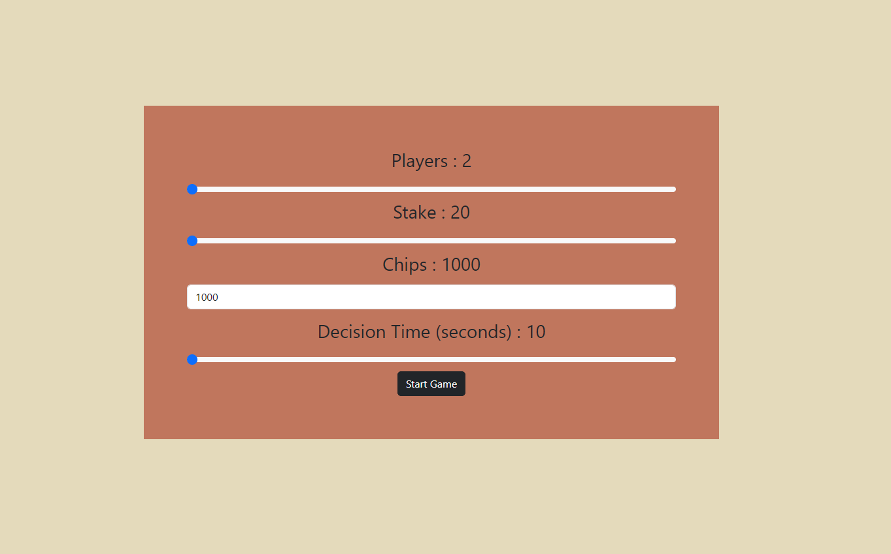

 

  <h3 align="center">Poker cash game </h3>

  

    A poker cash game 6 MAX players. You can play poker against bot players. Please try to win them..
     
     
  

## About The Project

Here is a poker game built with Angular. This game is a cash game that you can play with other 5 bot players. Τemporarily their decisions based on Math.random(), but at the next versions of this projects it will be the real advantage of this project as a student poker project.

User can select:

* How many players will be at the table
* The Blinds price
* How much chips
* The decision Time

Next versions will contain:

* Decision time restriction for user player too (now only bot players have time restriction).
* Some poker strategies about bot player's plays.
* Better Pot distribution (if a player goes all-in, at the end of the portion he can win all the pot)
*API for storing the game.

## Built With

This project written with Angular.

## Getting Started

### Installation

1. Installing the Angular CLI

2. Clone the repo

3. Install NPM packages *npm install

4. Ng serve

## Usage

The purpose of this poker project is to help players become better. Next versions will contain poker strategies for Bot players (now it's only a random function that decides),which will be explained at the end of each portion.

### Creating A Pull Request

## Authors

* **ilcamorista** - *Front-End Developer* - [ilcamorista](https://github.com/lympe92) - **

